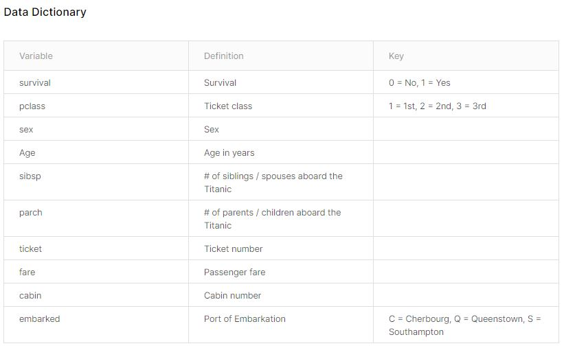
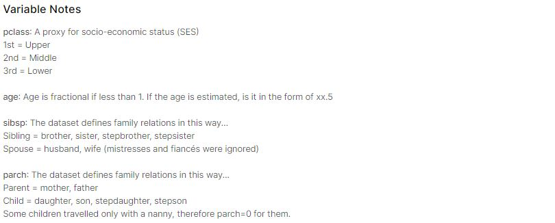
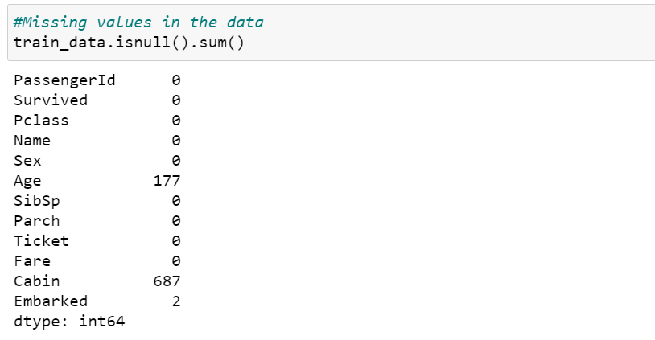

# Titanic Disaster - Survival Prediction

This repository contains all the files of the kaggle competition, related to Titanic Disaster in 1912.


# Table of Contents
- [Overview](#overview)
- [Data Dictionary](#DD)
- [Variable Descriptions](#VD)
- [Methodology](#method)
  - [Data Processing](#DP)
    - [Feature Elimination](#FE)
    - [Missing Value Imputation](#MVI)
  - [Feature Engineering](#FE)
    - [Name Analysis](#NA)
    - [Group Variables](#GV)
    - [Weight of Evidence](#WOE)
  - [Modeling](#ML)
    - [Train & Validation Split](#TVS)
    - [Train Multiple Models](#TMM)
    - [Model Selection](#MS)
  - [Scoring](#SC)
    - [Test Data Processing](#TDP)
    - [Final Predictions](#FP)
  
  


## Overview
The RMS Titanic sank in the early morning hours of ```15 April 1912``` in the North Atlantic Ocean, four days into her maiden voyage from Southampton to New York City. Though this is a disaster, we can use this data to ```learn how to handle such events in the future.```

## Data Dictionary
- We have been provided with a ```Train (891 x 12)``` & ```Test (418 x 11)``` datasets
- The dependant variable is `````"Survived"`````

  
## Variable Descriptions
- We can see the ```variable descriptions``` below


## Methodology
Now that we have understood what the problem statement is, I have followed the below ```steps``` to solve this.
- Data Pre Processing
  1. Feature Elimination
  2. Missing Value Imputations
  
- Feature Engineering
- Weight of Evidence Calculation
- Modeling & Selection
- Predictions on test data

### Data Pre Processing
Let us check for the ```missing values``` for each variable first, and then we will impute them with the appropriate methods. 


#### 1. Feature Elimination
- Drop ```cabin``` variable due to high missing percentage
- Drop ```fare``` because of **high correlation** with ```PClass```
- Drop ```Ticket``` variable due to low value addition
#### 2. Missing Value Imputations (MVI)
- We have already dropped the ```cabin``` variable, so we have to impute the ```Age``` and ```Embarked``` columns
You might have come across multiple methods of MVI, 

