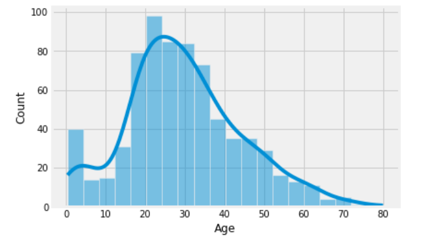

# Titanic Disaster - Survival Prediction

This repository contains all the files of the kaggle competition, related to Titanic Disaster in 1912.


# Table of Contents
- [Overview](#overview)
- [Data Dictionary](#data-dictionary)
- [Variable Descriptions](#variable-descriptions)
- [Methodology](#methodology)
  - [1. Data Processing](#data-pre-processing)
    - [Feature Elimination](#1-feature-elimination)
    - [Missing Value Imputation](#2-missing-value-imputations-mvi)
  - [2. Feature Engineering](#)
    - [Name Analysis](#NA)
    - [Group Variables](#GV)
    - [Weight of Evidence](#WOE)
  - [3. Modeling](#ML)
    - [Train & Validation Split](#TVS)
    - [Train Multiple Models](#TMM)
    - [Model Selection](#MS)
  - [4. Scoring](#SC)
    - [Test Data Processing](#TDP)
    - [Final Predictions](#FP)
  
## Overview
The RMS Titanic sank in the early morning hours of ```15 April 1912``` in the North Atlantic Ocean, four days into her maiden voyage from Southampton to New York City. Though this is a disaster, we can use this data to ```learn how to handle such events in the future.```

## Data Dictionary
We have been provided with a ```Train (891 x 12)``` & ```Test (418 x 11)``` datasets. The dependant variable is `````"Survived"`````

  
## Variable Descriptions
We can see the ```variable descriptions``` below


## Methodology
Now that we have understood what the problem statement is, let us follow a methodology to solve this. 

### Data Pre Processing
Let us check for the ```missing values``` for each variable first, and then we will impute them with the appropriate methods. 


#### 1. Feature Elimination
- Drop ```cabin``` variable due to high missing percentage
- Drop ```fare``` because of **high correlation** with ```PClass```
- Drop ```Ticket``` variable due to low value addition
#### 2. Missing Value Imputations (MVI)
We have already dropped the ```cabin``` variable, so we have to impute the ```Age``` and ```Embarked``` variables. Age is a continuous variable and its distribution is below.



