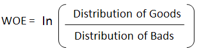

# Titanic Disaster - Survival Prediction

This repository contains all the files of the kaggle competition, related to Titanic Disaster in 1912.


# Table of Contents
- [Overview](#overview)
- [Data Dictionary](#data-dictionary)
- [Variable Descriptions](#variable-descriptions)
- [Methodology](#methodology)
  - [1. Data Processing](#1-data-pre-processing)
    - [Feature Elimination](#feature-elimination)
    - [Missing Value Imputation](#missing-value-imputations-mvi)
  - [2. Feature Engineering](#2-feature-engineering)
    - [Name Analysis](#NA)
    - [Group Variables](#GV)
    - [Weight of Evidence](#WOE)
  - [3. Modeling](#ML)
    - [Train & Validation Split](#TVS)
    - [Train Multiple Models](#TMM)
    - [Model Selection](#MS)
  - [4. Scoring](#SC)
    - [Test Data Processing](#TDP)
    - [Final Predictions](#FP)
  
## Overview
The RMS Titanic sank in the early morning hours of ```15 April 1912``` in the North Atlantic Ocean, four days into her maiden voyage from Southampton to New York City. Though this is a disaster, we can use this data to ```learn how to handle such events in the future.```

## Data Dictionary
We have been provided with a ```Train (891 x 12)``` & ```Test (418 x 11)``` datasets. The dependant variable is `````"Survived"`````

  
## Variable Descriptions
We can see the ```variable descriptions``` below


## Methodology
Now that we have understood what the problem statement is, let us follow a methodology to solve this. 

### 1. Data Pre Processing
Let us check for the ```missing values``` for each variable first, and then we will impute them with the appropriate methods. 


#### Feature Elimination
- Drop ```cabin``` variable due to high missing percentage
- Drop ```fare``` because of **high correlation** with ```PClass```
- Drop ```Ticket``` variable due to low value addition
#### Missing Value Imputations (MVI)
We have already dropped the ```cabin``` variable, so we have to impute the ```Age``` and ```Embarked``` variables. Age is a continuous variable and its distribution is below. From the figure we can say that ```Age``` is skewed.


I have used the median value of ```Age``` for a `passenger class` and `gender` to impute the missing values.

### 2. Feature Engineering
This is an import aspect of the methodology, because this is where the business intuition and domain expertise come in. And we all know how crucial these two are to make better predictions and to interpret the results of the model.  

#### Name Analysis
Though this variable `might not look important` at first, but we can extract some `hidden information` from this i.e., we can get the `Title` of each passenger and analyze if some `titles` have high survival probability. We have `Capt`, `Col`, `Don`, `Dr`, `Jonkheer`, `Lady`, `Major`, `Rev`, `Sir`, `the Countess`, `Miss`, and `Mrs`
#### Group Categories
I have now `grouped some categories` together because they have the `same event rates` i.e., `same probability of survival`.
#### Weight of Evidence
These categories have string values, so we need to convert them to numerical values but with the same degrees of freedom. So we use `Weight of Evidence` approach to accomplish this. 
##### What is Weight of Evidence (WOE)?
The weight of evidence tells the `predictive power` of an independent variable in relation to the dependent variable. It is generally described as a measure of the `separation of goods (Survived = 1)` and `bads (Survived = 0)`. We use the below formula to calculate the WOE and I have also provided a sample example for explanation purposes.



#### WOE Calculation for a variable with values `Category 1` & `Category 2`
```python
{
"""
#---------------------#
#   WOE & IV Example  #
#---------------------#

#-------------------#
#   Total           #
#-------------------#                       
Total Rows = 1000 || Total Goods = 300 || Total Bads = 700

#-------------------#                  |       #-------------------#
#   Category 1      #                  |       #   Category 2      #
#-------------------#                  |       #-------------------# 
All = 610 || Goods = 160 || Bads = 450 | All = 390 || Goods = 140 || Bads = 250

#--------------#
#   WOE & IV 1 #
#--------------#    
%Goods = (160/300) & %Bads = (450/700) => WOE 1 = ln(%Goods / %Bads) => IV 1 = WOE 1 * (%Goods - %Bads)

#--------------#
#   WOE & IV 2 #
#--------------#    
%Goods = (140/300) & %Bads = (250/700) => WOE 2 = ln(%Goods / %Bads) => IV 2 = WOE 2 * (%Goods - %Bads)
"""
}
```
### 3. Modeling


